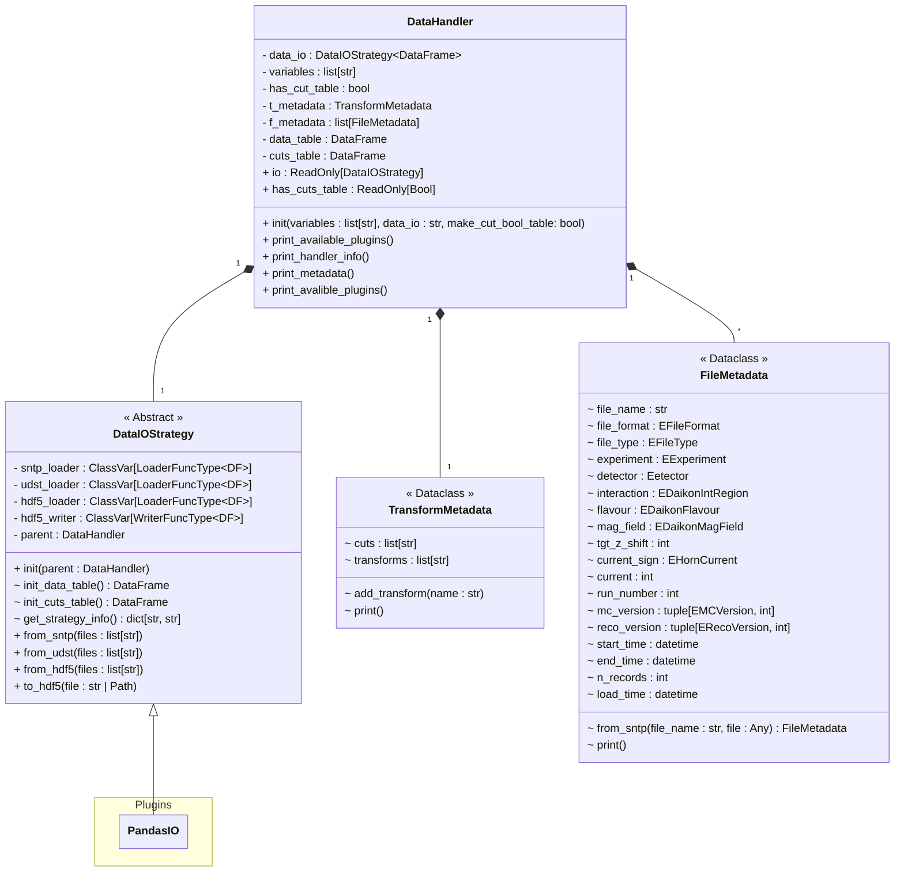

# Oscana: Oscillation Analysis Package

## Data Loading, Transformation & Saving

### Class Diagram

```mermaid
---
config:
    class:
        hideEmptyMembersBox: true
---
classDiagram

    DataIOStrategy <|-- PandasIO
    DataHandler "1" *-- "1" DataIOStrategy
    DataHandler "1" *-- "1" TransformMetadata
    DataHandler "1" *-- "*" FileMetadata
    
    class TransformMetadata {
        << Dataclass >>
        ~ cuts : list[str]
        ~ transforms : list[str]
        ~ add_transform( name : str )
        ~ print()
    }

    class FileMetadata {
        << Dataclass >>
        ~ file_name : str
        ~ file_format : EFileFormat
        ~ file_type : EFileType
        ~ experiment : EExperiment
        ~ detector : Eetector
        ~ interaction : EDaikonIntRegion
        ~ flavour : EDaikonFlavour
        ~ mag_field : EDaikonMagField
        ~ tgt_z_shift : int
        ~ current_sign : EHornCurrent
        ~ current : int
        ~ run_number : int
        ~ mc_version : tuple[EMCVersion, int]
        ~ reco_version : tuple[ERecoVersion, int]
        ~ start_time : datetime
        ~ end_time : datetime
        ~ n_records : int
        ~ load_time : datetime
        ~ from_sntp( file_name : str, file : Any) FileMetadata
        ~ print()
    }
    
    class DataIOStrategy~DF~{
        << Abstract >>
        - sntp_loader : ClassVar[LoaderFuncType~DF~]
        - udst_loader : ClassVar[LoaderFuncType~DF~]
        - hdf5_loader : ClassVar[LoaderFuncType~DF~]
        - hdf5_writer : ClassVar[WriterFuncType~DF~]
        - parent : DataHandler
        + init( parent : DataHandler )
        ~ init_data_table() DataFrame
        ~ init_cuts_table() DataFrame
        ~ get_strategy_info() dict[str, str]
        + from_sntp( files : list[str] )
        + from_udst( files : list[str] )
        + from_hdf5( files : list[str] )
        + to_hdf5( file : str | Path )
    }
    
    class DataHandler {
        - data_io : DataIOStrategy~DataFrame~        
        - variables : list[str]
        - has_cut_table : bool
        - t_metadata : TransformMetadata
        - f_metadata : list[FileMetadata]
        - data_table : DataFrame
        - cuts_table : DataFrame
        + io : ReadOnly[DataIOStrategy]
        + has_cuts_table : ReadOnly[Bool]
        + init(variables : list[str], data_io : str, make_cut_bool_table: bool)
        + print_available_plugins()
        + print_handler_info()
        + print_metadata()
        + print_avalible_plugins()
    }

    namespace Plugins {
        class PandasIO
    }
```
